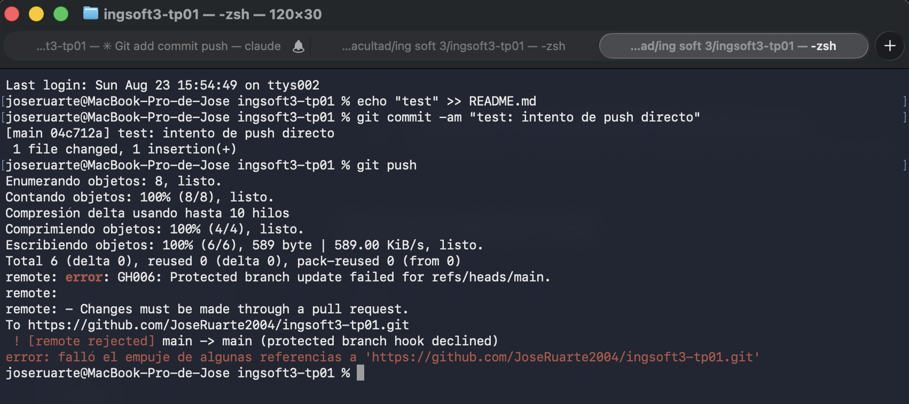
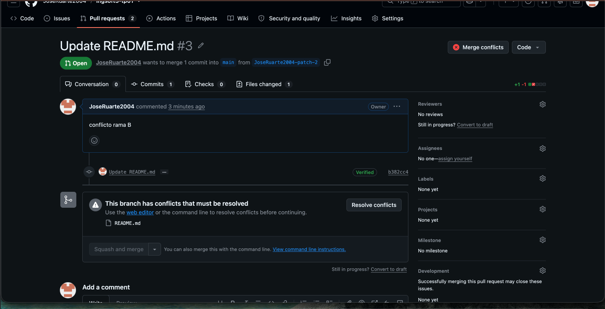
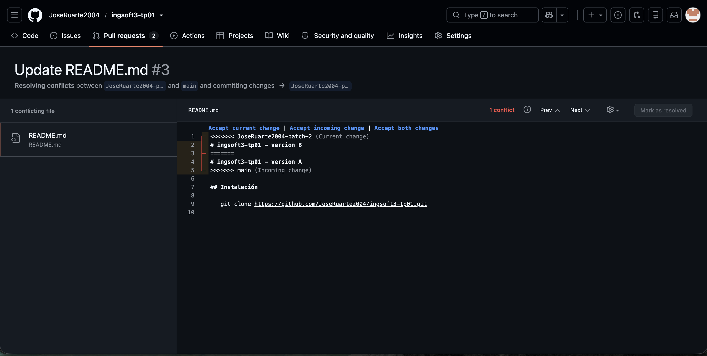
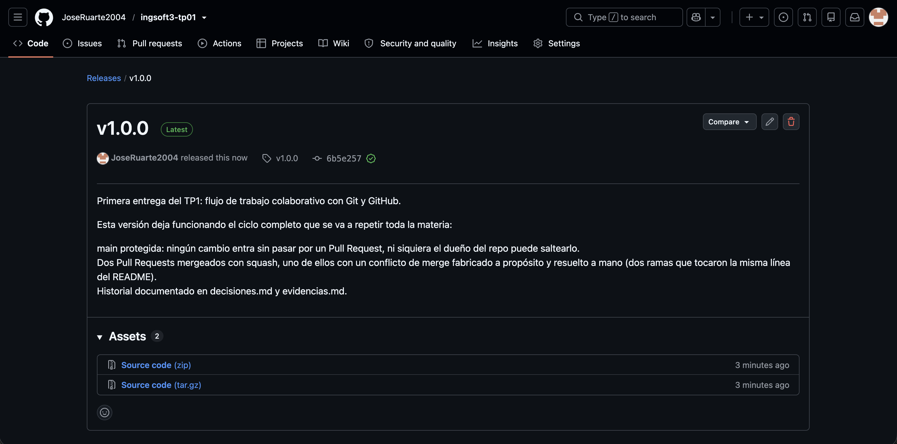

# Evidencias — TP1

## 1. Push directo a main rechazado

GitHub rechaza el intento de push directo a `main` porque la rama está protegida y la regla alcanza también al dueño del repositorio (sin bypass).

## 2. Aviso de conflicto en el PR de la rama B

Al intentar mergear el PR de la rama B después de haber mergeado la rama A, GitHub avisa que no se puede mergear automáticamente porque ambas ramas modificaron la misma línea del README.

## 3. Marcadores de conflicto

El editor de conflictos de GitHub muestra los marcadores `<<<<<<<`, `=======` y `>>>>>>>` delimitando el cambio de la rama actual (B) contra el de `main` (A).

## 4. Release v1.0.0 publicada

La release `v1.0.0`, generada a partir del tag del mismo nombre, publicada con las notas de qué incluye esta versión.
